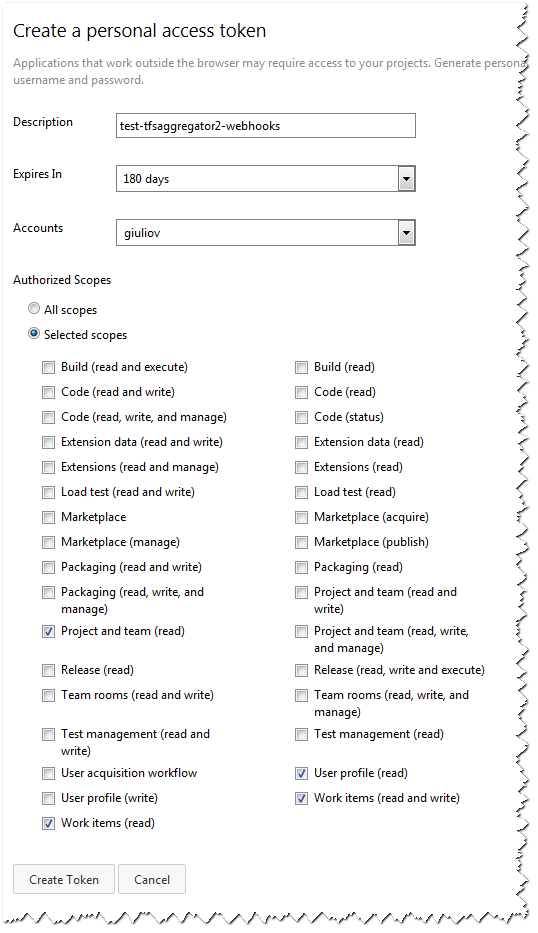

1. Install TfsAggregator WebHooks web application; use the `Deploy-TfsAggregatorWebHooks.ps1` as a sample script
    * use SSL to avoid exposing credentials
    * the account running Aggregator application pool must have proper permissions on the target TFS _or_ you set some credentials in the policy file
2. Configure the policy
    * define the `policyFilePath` in `web.config` e.g. `<add key="policyFilePath" value="~/App_Data/{CollectionId}.policies" />`
    you can use a static path if you use a single policy file, or use a request variable (see below)
    * prepare one or more policy files (see below the new features)
3. Grant access to TFS/VSTS
    * For VSTS create a Personal Access Token and add it to the sample policy file (e.g. )
    * For TFS you can give permission to the account running the apppool (see https://github.com/tfsaggregator/tfsaggregator/wiki/Troubleshooting) or put the credential in the policy file
4. Now you have to setup the caller, see https://www.visualstudio.com/en-us/get-started/integrate/service-hooks/webhooks-and-vso-vs
    * point the URL of WebHooks, e.g. `https://tfsaggregator.example.com/API/WorkItem`

> NOTE the VSTS Test button sends a well-formed document, but some TFS versions not, so to real test you need to create/modify some work item

> The HelloWorld policy works for any kind of work items.

## Request variables for `policyFilePath`
The variable for `policyFilePath`, extracted from the incoming request data are:
 * `{EventType}` could be `workitem.created` `workitem.updated` `workitem.restored` or `workitem.deleted`
 * `{AccountId}` Guid of VSTS Account (TFS will get this with version "15")
 * `{CollectionId}` Guid of collection
 * `{TeamProject}` name of the Team Project
 * `{TfsCollectionUri}` URL of the collection

## Specify Authentication in the policy
The `runtime/authentication` element accept two new options

 1. Explicit credentials
    `<authentication username="DOMAIN\user" password="***" />`
    not much secure, but handy for testing and some edge scenario
 2. Personal Authentication Token
    `<authentication personalToken="***" />`

# CHANGELOG
## [0.0.2 TO BE RELEASED] - 2016-09-*
### Added
- Upgrade .Net Fx
- Smoke test
- Can opt-out SSL
- Can specify port
### Fixed
- More comments
- Wrong folder path
- 

## [0.0.1] - 2016-08-12
### Added
- Initial alpha release to testers

