Installing TFS Aggregator WebHooks is a six step process:

 1. [Grant access to VSTS/TFS](#grant-access-to-vststfs)
 2. [Deploy TfsAggregator WebHooks web application](#deploy-tfsaggregator-webhooks-web-application)
 3. [Configure TFS Aggregator](#configure-tfs-aggregator)
 4. [Define the policy](#define-the-policy)
 5. [Setup logging (optional)](#setup-logging-optional)
 6. [Setup the Web Hooks in TFS/VSTS](#setup-the-web-hooks-in-tfsvsts)


# Grant access to VSTS/TFS

There are  three possible options to grant access. In most cases you will have to change the configuration later using the values collected in this step.

## 1. Using a Personal Access Token

a. Create a Personal Access Token 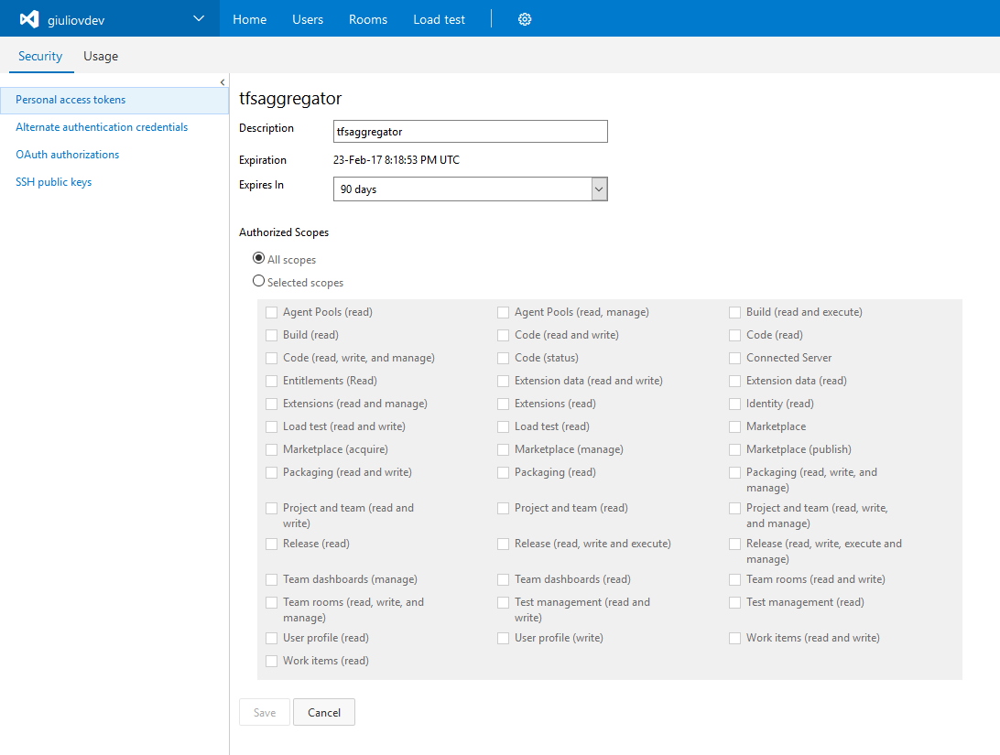
> Leave **All scopes** select; TFS Aggregator use the old Object Model (see [Authentication issue using Personal Access Token when all options of "Selected Scope" are selected](https://social.msdn.microsoft.com/Forums/vstudio/en-US/5564cb2b-4e46-4a41-b12c-bc50304c777b/authentication-issue-using-personal-access-token-when-all-options-of-selected-scope-are-selected?forum=TFService)).
b. Capture Personal Access Token's value and store it for later 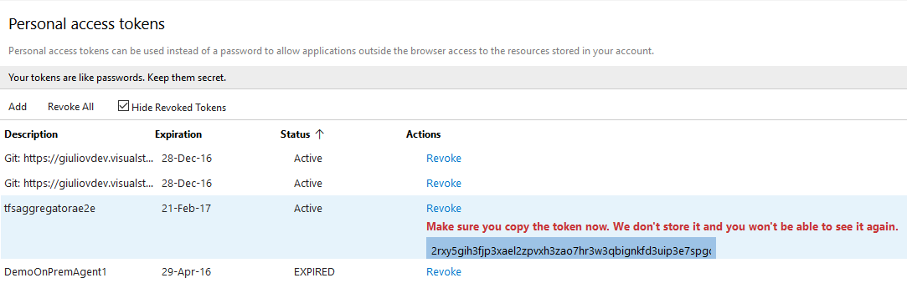

> NOTE: this is per-account value you can use (User Profile/Security)

## 2. [TFS only] Account permissions
instead of a PAT, you can give permission to the account running the Application Pool (see https://github.com/tfsaggregator/tfsaggregator/wiki/Troubleshooting)

## 3. [TFS only] Explicit credentials 
or put username and password in clear text in the `/AggregatorConfiguration/runtime/authentication` node of the policy file

If you do not allow access expect a similar error
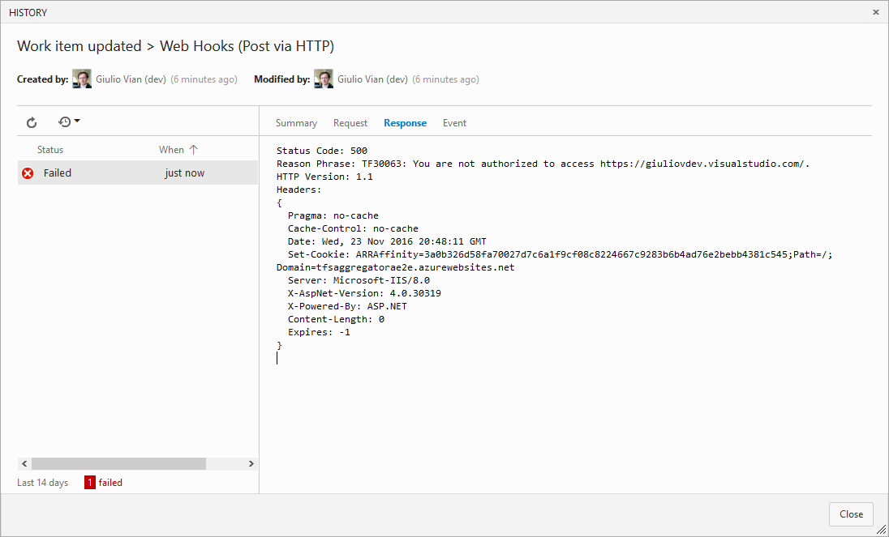


# Deploy TfsAggregator WebHooks web application

## 1. [TFS only] Install on IIS 

To install TfsAggregator WebHooks web application you can use the `Deploy-TfsAggregatorWebHooks.ps1` as a sample script
 * use SSL to avoid exposing credentials
 * the account running Aggregator application pool must have proper permissions on the target TFS _or_ you set some credentials in the policy file

## 2. Deploy to Azure

Use the [](https://azuredeploy.net/) button.
This is the simplest option for VSTS.

In the wizard specify the 

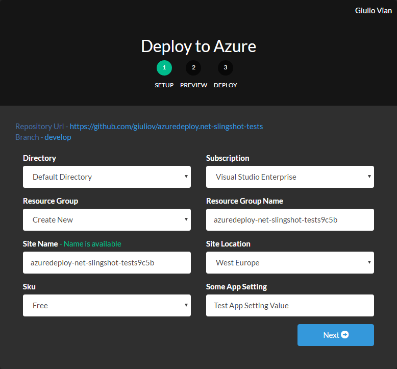

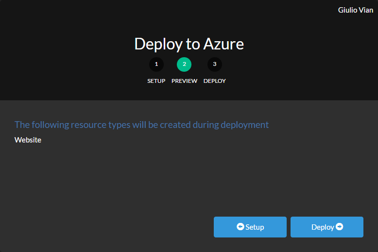

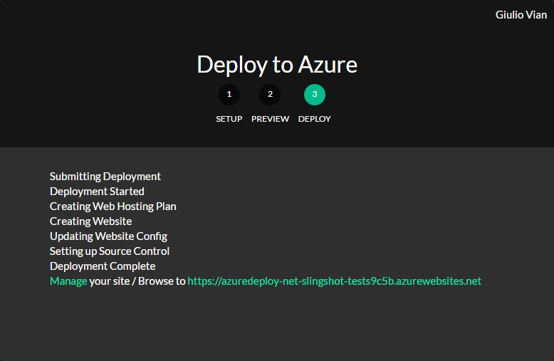

Please take note of the URL for the next steps.

You can check that the deploy worked, by opening a browser to the above URL appending `/api/workitem`
 
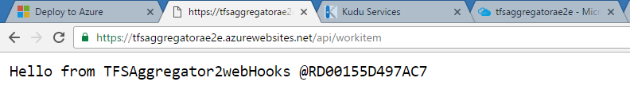


# Configure TFS Aggregator

To edit the deployed files, use Kudu console

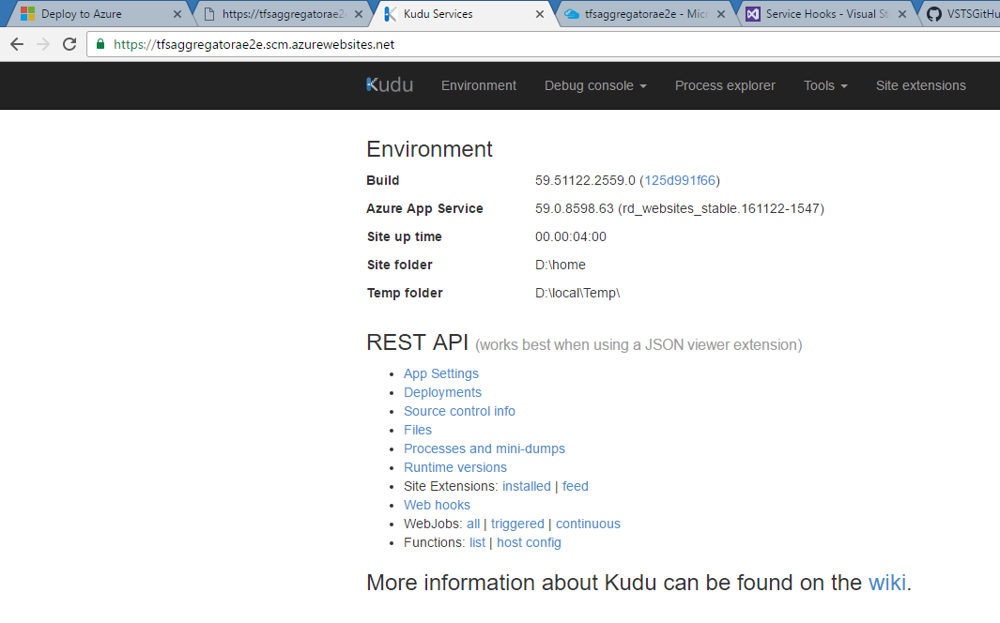

at the `https://`<name_chosen_in_previous_step>`.scm.azurewebsites.net` URL. Navigate to `site\wwwroot` folder via **Debug console** menu.

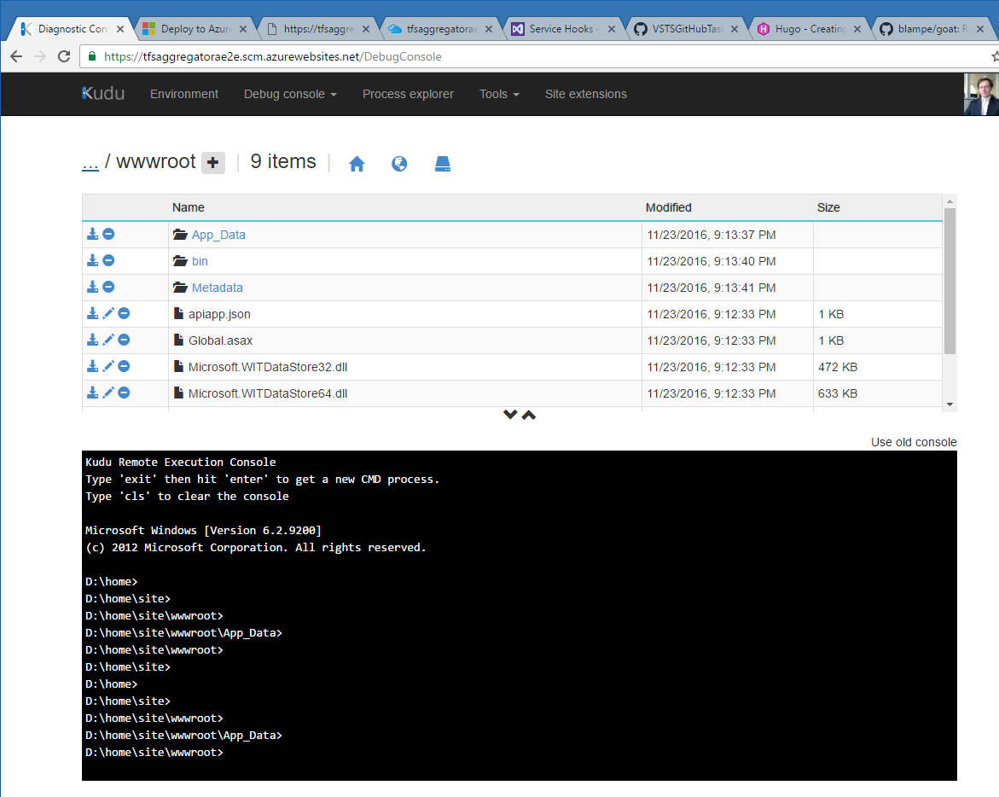

## Add users to `web.config` file

Add at least one user in the `Users` section
```
  <Users>
    <add key="vsts" value="P@ssw0rd!" />
  </Users>
```

## Configure the policy mapping

Define the `policyFilePath` in `web.config`; the default value is the static path of the sample policy.


Instead of a static path you can use a variable value from the incoming request e.g. `<add key="policyFilePath" value="~/App_Data/{CollectionId}.policies" />`.
The possible variables for `policyFilePath`, extracted from the incoming request data are:
 * `{EventType}` could be `workitem.created` `workitem.updated` `workitem.restored` or `workitem.deleted`
 * `{AccountId}` Guid of VSTS Account (TFS 2017 or later)
 * `{CollectionId}` Guid of collection
 * `{TeamProject}` name of the Team Project
 * `{TfsCollectionUri}` URL of the collection


# Define the policy

Navigate to the `App_Data` folder to edit the policy files

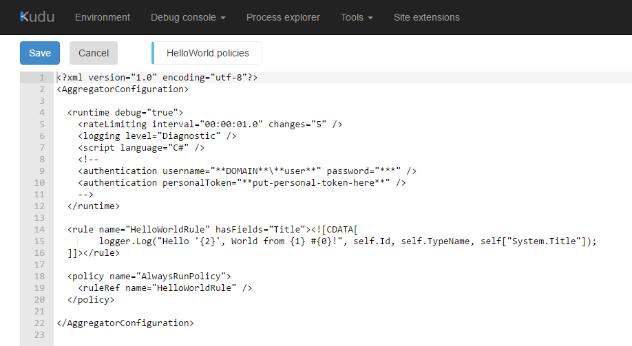

> The default HelloWorld policy works for any kind of work items.

## Specify Authentication in the policy
The `runtime/authentication` element accept two new options

 1. Explicit credentials
    `<authentication username="DOMAIN\user" password="***" />`
    not much secure, but handy for testing and some edge scenario
 2. Personal Access Token (obtained on step 1)
    `<authentication personalToken="***" />`

In the policies you may have to set the credentials chosen in the first step, e.g. the PAT. 

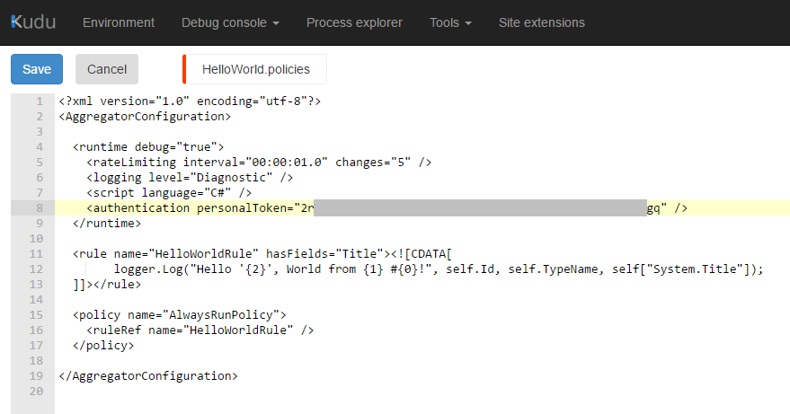


# Setup logging (optional)

This step is not mandatory, but recommended in the initial phase.

In the [Azure Portal](https://portal.azure.com/) navigate to **App Services** and select the App Service hosting TFS Aggregator. Scroll down to **Diagnostic logs** and turn on **Application Logging**.

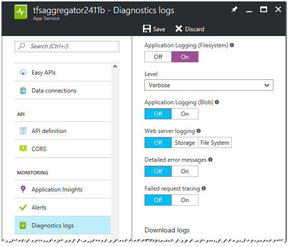

Select the Verbosity level and save.

> You can store the logs in Azure storage for auditing.

In the Kudu console navigate to the `LogFiles\Application` folder to find the log files produced by TFS Aggregator.

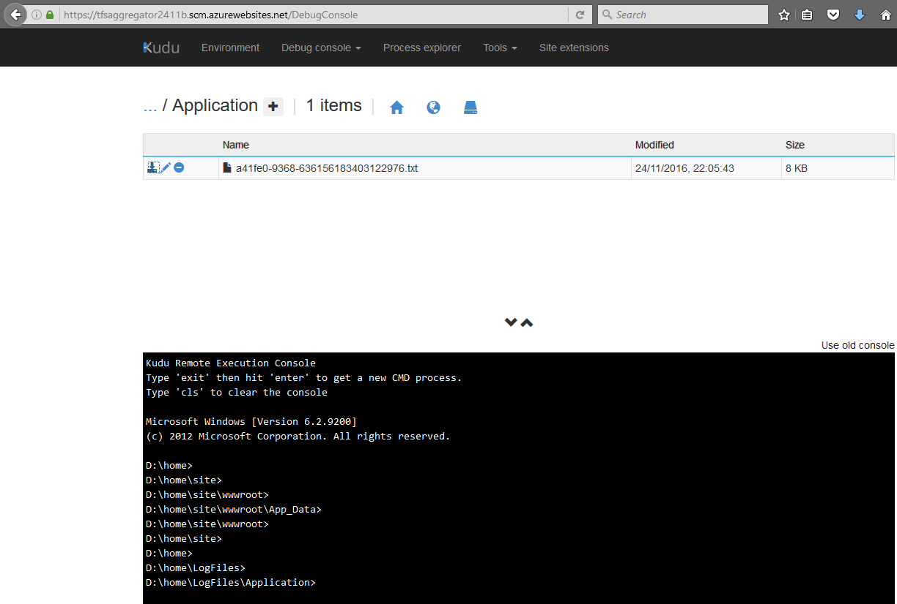

By opening the file you see a snapshot of log file's content.

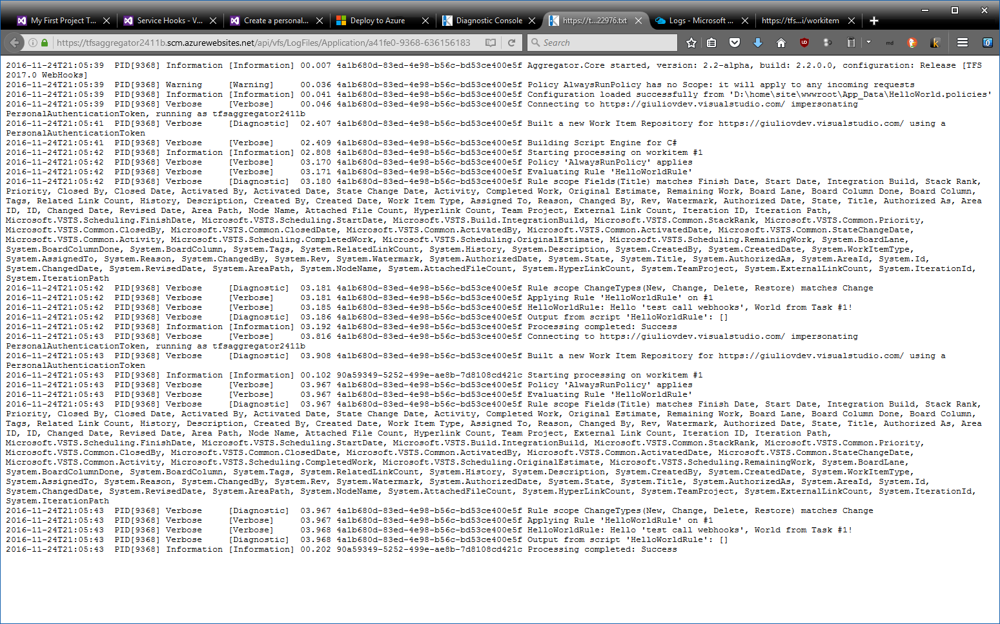


# Setup the Web Hooks in TFS/VSTS

This is the last step: setup the caller, i.e. configure VSTS/TFS to invoke TFS Aggregator (see also [Web Hooks](https://www.visualstudio.com/en-us/docs/integrate/get-started/service-hooks/services/webhooks)).

## Using Powershell

In the `samples` folder you can find the `Create-Subscriptions.ps1` Powershell script to quickly setup the subscription.
It requires six arguments and creates the subcription for create, update and restore events.

| Argument            | Description                                             | Sample value |
|---------------------|---------------------------------------------------------|-----------------------------------------------------------|
| tfsURL              | TFS/VSTS base URL                                       | `https://me.visualstudio.com/`                            |
| ProjectName         | TFS/VSTS project name                                   | `My Project`                                              |
| PersonalAccessToken | Personal Access Token generated in step 1               | `jocxco3i7twydcif25bh7yysbodwnq4ppuannhro4yryfcbab4na`    |
| aggregatorURL       | URL of TFS Aggregator WebHooks API                      | `https://mytfsaggregator.azurewebsites.net/api/workitem/` |
| aggregatorUsername  | Username listed in TFS Aggregator WebHooks `web.config` | `vsts`                                                    |
| aggregatorPassword  | Password for the above                                  | `P@ssw0rd!`                                               |

> The `workitem.deleted` fails with error `TF26198: The work item does not exist, or you do not have permission to access it.`
> This is an issue with VSTS/TFS that we cannot solve.

## Manual configuration

> NOTE: this is a per-project configuration (Project/Admin).

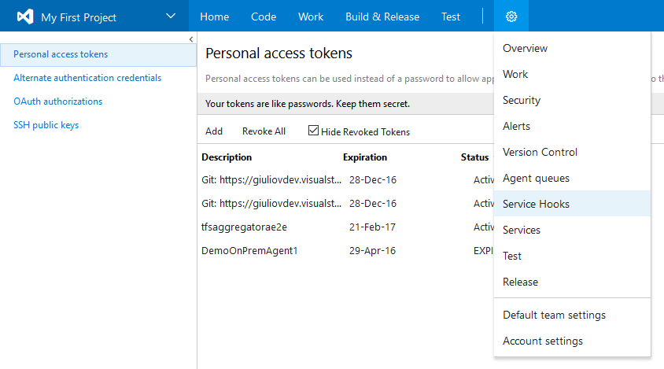

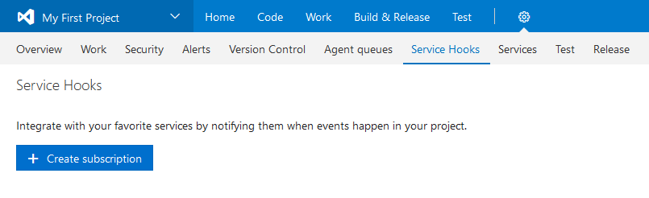

Select **Web Hooks**
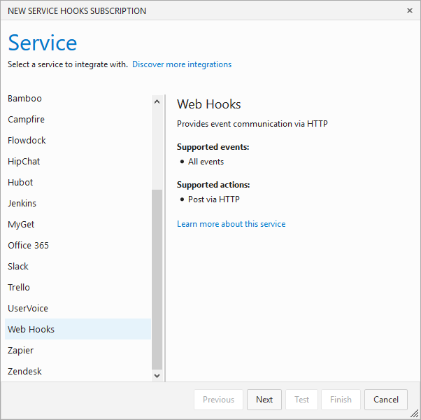

Select the triggering event
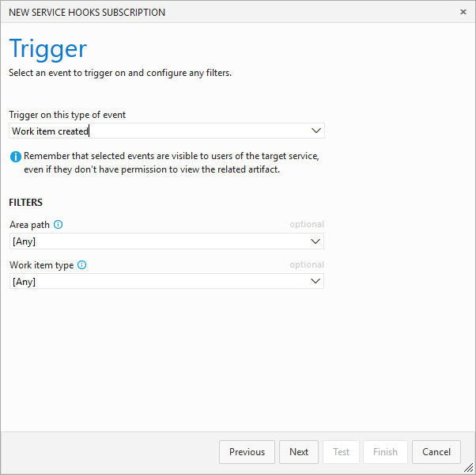

> You may have to repeat this step for all four event:
> * New/created
> * Change/updated
> * Delete
> * Restore

Insert the URL, e.g. `https://`<name_chosen_in_deploy_step>`.azurewebsites.net/api/workitem` and one user listed in TFS Aggregator `web.config` file.
 
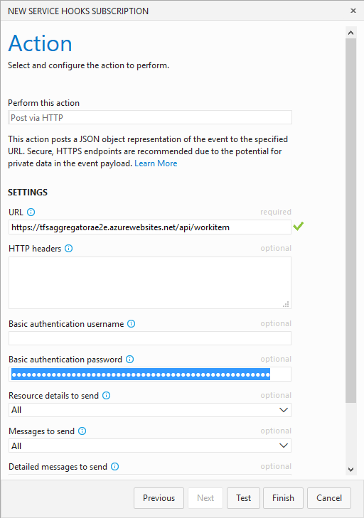

> NOTE the **Test** button above may send a well-formed document or not, so to test if everything works you really must create/modify some work item.

This is the result with a single hooked event.
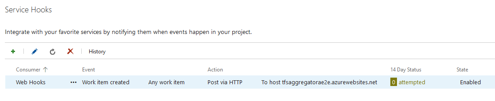

And after all four events are defined.
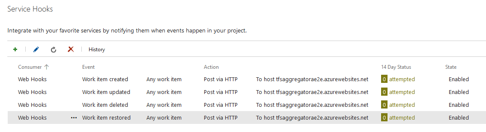


# Final testing

At this point the configuration is complete and you can test, e.g. creating a new work item.

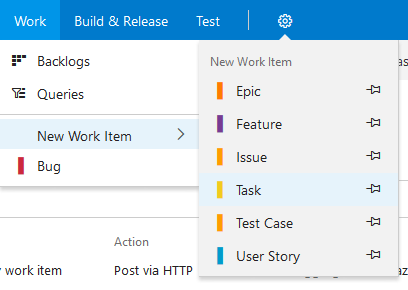

You see in the **Service Hooks** page

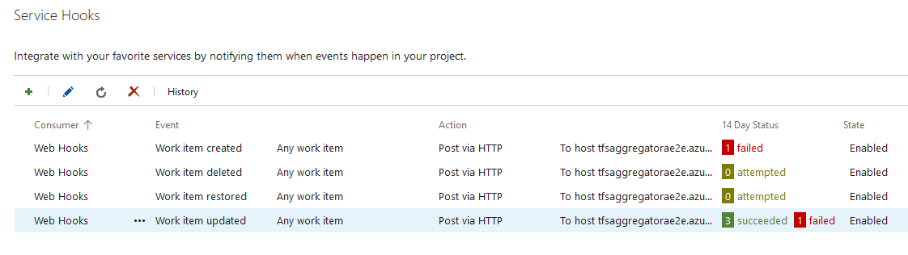

the success or failure.
Remember that you can see the TFS Aggregator log to help troubleshooting.
